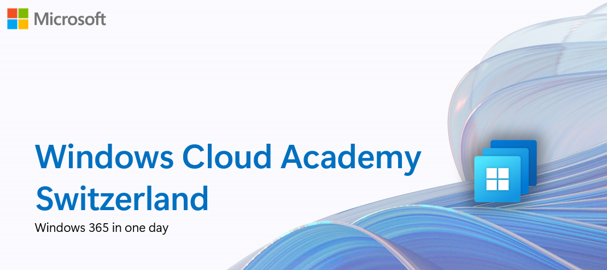

# Windows Cloud Academy

The Windows Cloud Academy Switzerland is designed to help you get hands-on experience with Windows 365 (W365) .

W365 - is a cloud-based service that automatically provisions Cloud PCs—dedicated Windows devices assigned to individual users. It combines the productivity, security, and collaboration features of Microsoft 365 with the flexibility of the cloud.

## Learning objectives 

By the end of this Academy, you'll be able to:

- Choose the right virtual desktop solution for your needs.
- Set up and manage Windows 365 Cloud PCs 
- Configure Intune device policies, manage RDP properties, and deploy applications.

## Requirements

- Basic Intune knowledge [(Microsoft Intune fundamentals)](https://learn.microsoft.com/en-us/training/paths/endpoint-manager-fundamentals/)

## Agenda

1.	Welcome
2.	Windows 365 solution overview
3. Licensing model
4. Enterprise architeture design
5.	Getting started with Windows 365
6.	Q&A

## Rules

 1. Do not abuse the power of Admin Rights to sabotage or manipulate other attendees and their resources.
 2. You will receive your Admin & User credentials personally, take good care of it.
 3. Please name all your resources with **PUNK[count]**, e.g. PUNK1. 
 
 ## The environment
 
 This is the Windows Cloud Academy Architecture:
 
- Windows 365 Enterprise 2 vCPU, 8 GB, 128 GB :  25 licenses
- Windows 365 Felx 2 vCPU, 8 GB, 128 GB :  25 licenses
- No custom image
- No ANC
 
 ## Credentials
 
 You will receive your Admin & User credential personally and take good care of it.
 
 ## Access Windows Cloud Solutions
 
 - [Windows App Webclient](https://windows.cloud.microsoft/)
 - [Windows App for Windows (Microsoft Store)](https://apps.microsoft.com/detail/9N1F85V9T8BN) or [Windows App (offline installer)](https://go.microsoft.com/fwlink/?linkid=2262633)
 - [Windows App for macOS](https://aka.ms/WindowsAppForMacOS)

 ## Challenges
  
 ### Windows 365
 
 - Challenge 1: **[Provisioning a Windows 365 Enterprise Cloud PC](Windows365/01-W365ENT-Provisioning-CPC.md)**
 - Challenge 2: **[Configure RDP Properties](Challenges/W365/02-W365-RDP-Properties.md)**
 - Challenge 3: **[Deploy application via Intune](Challenges/W365/03-W365-App-Deployment.md)**
 - Challenge 4: **[Deploy Windows 365 Flex Shared Desktop or Cloud Apps](Challenges/W365/04-W365-Flex.md)**

 ### Windows 365 for Agents (Draft)

 - Challenge 1: **[Build a Copilot Studio Agent with Computer Use on Windows 365 (Draft)](Challenges/W365A/01-W365A-Copilot-Agent.md)**

## Contributor
- [Jean-Noël Buosi](https://www.linkedin.com/in/jean-noël-buosi/)
- [Slavko Vasic](https://www.linkedin.com/in/slavkovasic/)
- [Christian Volkmer](https://www.linkedin.com/in/slavkovasic/](https://www.linkedin.com/in/cvolkmer/)
- [Ben Martin Baur](https://www.linkedin.com/in/ben-martin-baur/)
- [Daniel Weppeler](https://www.linkedin.com/in/daniel-weppeler/)

Engineered and powered by [avdpunks.com](https://avdpunks.com)

